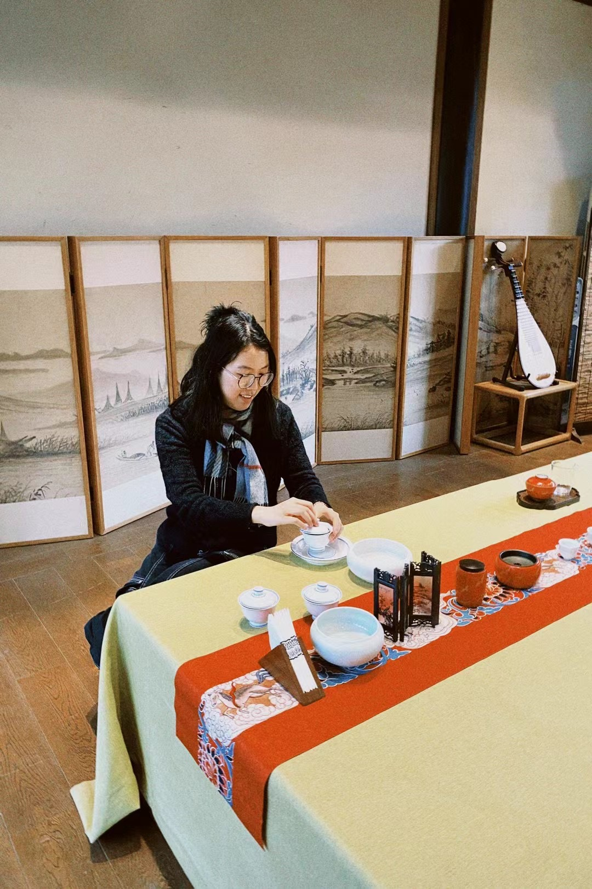

## About Me

I am a Postdoctoral Associate at MIT EECS [Healthy ML Group](https://healthyml.org/people/), hosted by Prof. [Marzyeh Ghassemi](https://www.csail.mit.edu/person/marzyeh-ghassemi). 

I recently received my Ph.D. from [Cornell University](https://gradschool.cornell.edu/spotlights/student-spotlight-yuexing-hao/) (2022-25) and was an IvyPlus Exchange Scholar at [MIT](https://www.linkedin.com/posts/aihealthmit_mit-postdoc-yuexing-hao-on-how-an-ai-agent-activity-7418000548697673729-FUIp/) (2024-25). I interned at [Google Research](https://research.google/blog/towards-better-health-conversations-research-insights-on-a-wayfinding-ai-agent-based-on-gemini/) (2025), Scale AI (2025), and [Mayo Clinic](https://newsnetwork.mayoclinic.org/discussion/new-mayo-clinic-study-advances-personalized-prostate-cancer-education-with-an-ehr-integrated-ai-agent/) (2024). I hold Computer Science degrees from [Rutgers University](https://math.sas.rutgers.edu/news-events/news/honors-awards-distinction/1588-rutgers-undergraduate-receives-meritorious-performance-award-in-modeling-contest) (B.A., 2017-20) and [Tufts University](https://yuexinghao.github.io/Yuexing-Hao/assets/files/awards/Hao-Yuexing-GSRC-Letter.pdf) (M.S., 2020-22).

I founded a (semi-successful) AI for medication management company ([Hug Medical](https://hugmed.ai/)) in 2022. 

My [old personal website](https://1135100136.wixsite.com/yuexinghao/blog) has some interesting posts. Stop using it from Aug 2022.

Presently, I am based in beautiful Boston, MA. In my spare time, I love to do many outdoor activities, such as ice hockey, squash, and water skiing. My name means "happy walking is good", and the pronunciation is "You-Sing." I am a tea aficionado and drink pre-rain dragon well tea everyday.

  

<!-- ## Research Interests 

<ul id="research-interests-list">
<li><strong>Human-Computer Interaction (HCI):</strong> Human-AI Interaction [[CHI 26'](https://arxiv.org/abs/2510.18880), [NPJ Digital Medicine 25' (MedEduChat)](https://www.nature.com/articles/s41746-025-02166-0), [IntelliSys 21'](https://link.springer.com/chapter/10.1007/978-3-030-82193-7_36)], Decision Support Tool (DST) [[CHI 23'](https://dl.acm.org/doi/abs/10.1145/3544548.3581393), [Bioinformatics 20'](https://academic.oup.com/bioinformatics/article/36/16/4458/5813330), [CSCW 24 (b)'](https://dl.acm.org/doi/10.1145/3678884.3681859)], Artificial Intelligence of Things (AIoT) [[CHI EA 25'](https://dl.acm.org/doi/abs/10.1145/3706599.3719286)], Trustworthy [[ICLR 26'](https://arxiv.org/abs/2502.14296)], Explainable LLM</li>
<li><strong>AI for Health:</strong> Clinical Decision Science [[CSCW 23'](https://dl.acm.org/doi/abs/10.1145/3584931.3607023), [CSCW 24 (a)'](https://dl.acm.org/doi/abs/10.1145/3678884.3681841), [NPJ Digital Medicine 25' (Review)](https://www.nature.com/articles/s41746-025-01824-7)], Patient-centered Framework [[CHI 24'](https://dl.acm.org/doi/abs/10.1145/3613904.3642353), [MCP: Digital Health 25'](https://www.sciencedirect.com/science/article/pii/S2949761225000057)], Veterinary Precision Health [[AAAI 24'](https://ojs.aaai.org/index.php/AAAI/article/view/30450)]</li>
<li><strong>LLM Reverse Engineering:</strong> Alignment & Data Attribution [[Preprint 25' (MedPAIR)](https://arxiv.org/abs/2505.24040), [Preprint 25' (MedGUIDE)](https://arxiv.org/abs/2505.11613)], Perturbation [[Preprint 25' (MedPerturb)](https://arxiv.org/abs/2506.17163)], LLM Computing Equity [[Preprint 25' (GPU Equity)](https://arxiv.org/abs/2510.13621)]</li>
</ul> -->












